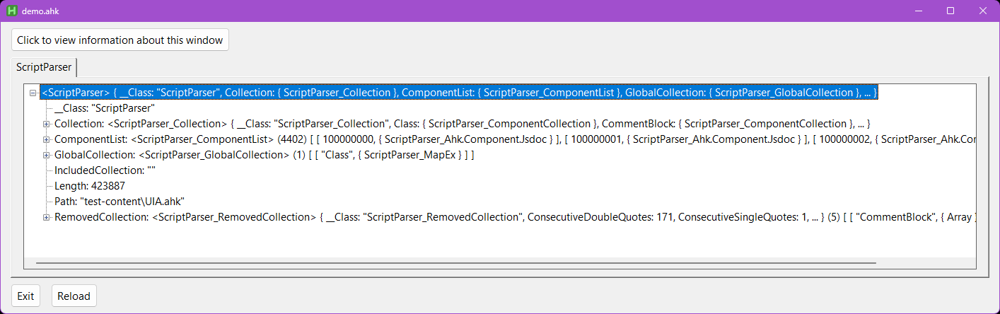
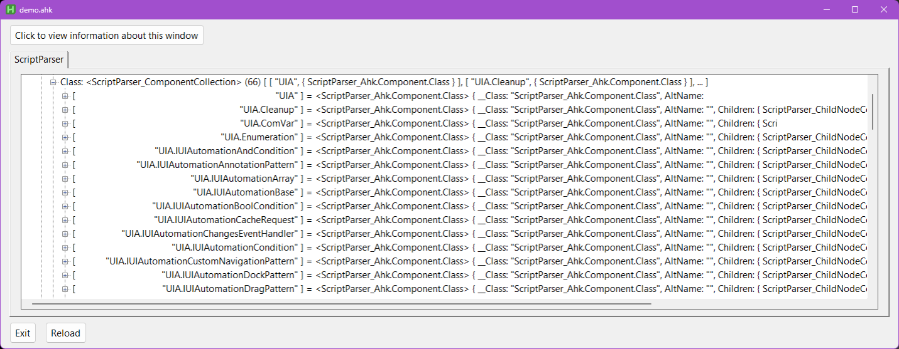
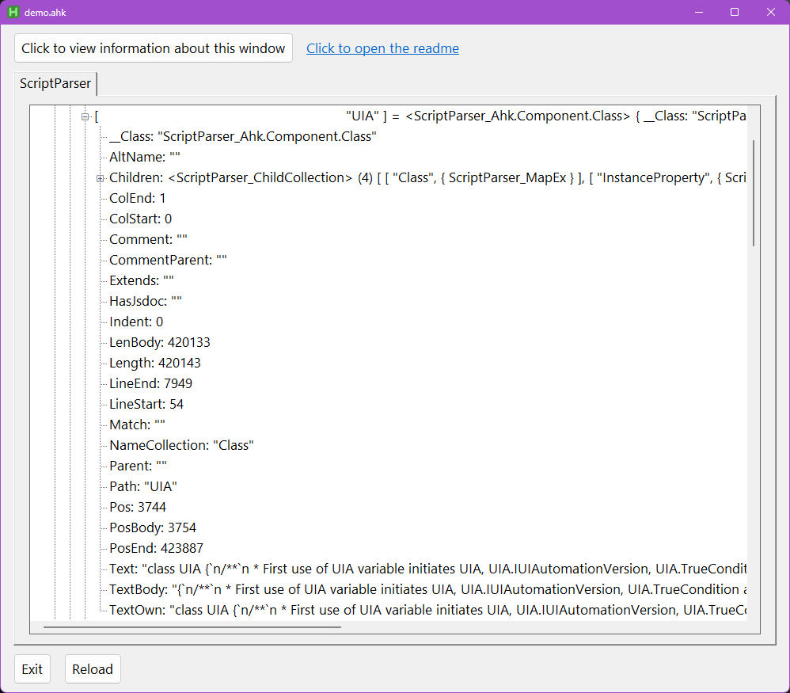
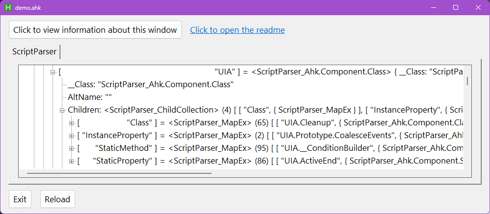
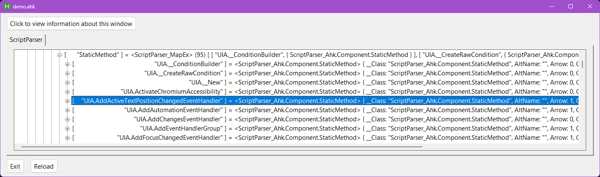
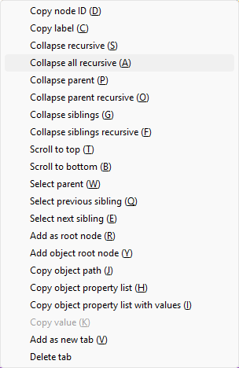

# ScriptParser

A class that parses AutoHotkey (AHK) code into usable data objects.

# Table of contents

<ol type="I">
  <li><a href="#introduction">Introduction</a></li>
  <li><a href="#use-cases">Use cases</a></li>
  <li><a href="#quick-start">Quick start</a></li>
  <li><a href="#autohotkeycom-post">AutoHotkey.com post</a></li>
  <li><a href="#redditcom-post">Reddit.com post</a></li>
  <li><a href="#demo">Demo</a></li>
  <ol type="A">
    <li><a href="#the-demo-gui">The demo gui</a></li>
    <ol type="1">
      <li><a href="#the-collection-object">The collection object</a></li>
      <li><a href="#nodes">Nodes</a></li>
      <li><a href="#component-objects">Component objects</a></li>
      <li><a href="#children">Children</a></li>
      <li><a href="#context-menu">Context menu</a></li>
    </ol>
  </ol>
  <li><a href="#community-tools">Community tools</a></li>
  <li><a href="#options">Options</a></li>
  <li><a href="#the-scriptparser-object">The ScriptParser object</a></li>
  <li><a href="#the-collection-property">The "Collection" property</a></li>
  <li><a href="#the-component-object">The component object</a></li>
  <li><a href="#parameters">Parameters</a></li>
  <li><a href="#dynamic-properties">Dynamic properties</a></li>
  <li><a href="#strings">Strings</a></li>
  <li><a href="#comments">Comments</a></li>
  <li><a href="#scriptparser_getincluded">ScriptParser_GetIncluded</a></li>
  <ol type="A">
    <li><a href="#parameters-1">Parameters</a></li>
  </ol>
  <li><a href="#changelog">Changelog</a></li>
</ol>
<ul><i><sub>Table of contents generated by <a href="https://github.com/Nich-Cebolla/AutoHotkey-LibV2/blob/main/Headers2ToC.ahk">Headers2ToC.ahk</a></i></sub></ul>

# Introduction

`ScriptParser` parses AHK code into data objects representing the following types of components:

- Classes
- Global functions
- Static methods
- Instance methods
- Static properties
- Instance properties
- Property getters
- Property setters
- Comment blocks (multiple consecutive lines of ; notation comments)
- Multi-line comments (/* */ notation comments)
- Single line comments (; notation comments)
- JSDoc comments (/** */ notation comments)
- Strings

For example, say I have the following script:

```ahk
class MyClass {
    /**
     * @param {Type} param1 - info
     * @param {Type} [param2] - info
     * @returns {Type}
     */
    static Method(param1, param2 := "value") {

    }
    static Property {
        Get {
        }
        Set {
        }
    }
    /**
     * @classdesc - MyClass info...
     * @param {Type} [params] - info
     */
    __New(params*) {

    }
    ; details about Property
    Property := "Value"
}

MyFunc(param1, param2, params*) {

}
```

When I create the `ScriptParser` object, I will have access to data objects that provide me with
information about `MyClass`, `MyClass.Method`, `MyClass.Property`, `MyClass.Property.Get`,
`MyClass.Property.Set`, `MyClass.Prototype.__New`, `MyClass.Prototype.Property` (instance property),
`MyFunc`, and the three comments. The kinds of information available are:
- Full text of the component.
- Character position details, such as start and end position, start and end line, and start and end
  character column number.
- Child components.
- For functions and methods, details about parameters.
- Comments are associated with the code directly beneath them.
- Details about function parameters and property accessor parameters.

Assume the above code is saved to file "MyScript.ahk"...
```ahk
#include <ScriptParser>

script := ScriptParser({ Path: "MyScript.ahk" })
collection := script.Collection
_myClass := collection.Class.Get("MyClass")
OutputDebug(_myClass.Text "`n") ; Prints the entire MyClass text
_method := _myClass.Children.Get("StaticMethod").Get("Method")
params := _method.Params
OutputDebug(params[1].Symbol "`n") ; param1
OutputDebug(params[2].DefaultValue "`n") ; "value"
OutputDebug(_method.Comment.TextComment "`n") ; @param {Type} param1 - info
                                                ; @param {Type} [param2] - info
                                                ; @returns {Type}
OutputDebug(_method.TextBody "`n") ; Prints the body of MyClass.Method (text between curly braces)
```

# Use cases

I wrote `ScriptParser` as the foundation of another tool that will build documentation for my scripts
by parsing the code and comments. That is in the works, but `ScriptParser` itself is complete and
functional.

Here are some other possible uses for `ScriptParser`:
- Reflective processing, code that evaluates conditions as a function of the code itself
- A tool that replaces function calls with the function code itself (to avoid the high overhead cost
  of function calls in AHK)
- Grabbing text to display in tooltips (for example, as part of a developer tool)
- Dynamic execution of code in an external process using a function like [ExecScript](https://www.autohotkey.com/docs/v2/lib/Run.htm#ExecScript)

If you make a tool that features `ScriptParser` and if you would like your tool to be hosted in the
"extensions" folder in this repository, please submit a pull request with your script added to the
folder.

If you would like to add a link to your script that features `ScriptParser` in the [Community tools](#community-tools)
section, please submit a pull request with your link added.

# Quick start

The following is a brief introduction intended to share enough information for you to make use
of this library. Run the [demo script](#demo) to visually explore the properties and items accessible
from `ScriptParser` objects.

1. Clone the repository.
  ```cmd
  git clone https://github.com/Nich-Cebolla/AutoHotkey-ScriptParser
  ```

2. Make a copy of the cloned repository and work with the copy. This is to avoid a situation where
  pulling an update breaks our scripts; by using a separate copy we can give ourselves time to review
  updates before updating the active copy.
  ```cmd
  xcopy AutoHotkey-ScriptParser AutoHotkey-ScriptParser-Active /I /E
  ```

3. Add a file ScriptParser.ahk to your [lib folder](https://www.autohotkey.com/docs/v2/Scripts.htm#lib).
  In the file is a single statement.
    ```ahk
    #include C:\path\to\AutoHotkey-ScriptParser-Active\src\VENV.ahk
    ```

4. Include the library in your script.
  ```ahk
  #include <ScriptParser>
  ```

5. Use the object
  ```ahk
  #include <ScriptParser>

  sp := ScriptParser({ Path: "MyScript.ahk" })
  ```

# AutoHotkey.com post

Join the conversation on [AutoHotkey.com](https://www.autohotkey.com/boards/viewtopic.php?f=83&t=139709).

# Reddit.com post

Join the conversation on [Reddit.com](https://www.reddit.com/r/AutoHotkey/comments/1ph7eiq/scriptparser_a_class_that_parses_ahk_code_into/).

# Demo

The demo script launches a gui window with a tree-view control that displays the properties and items
accessible from a `ScriptParser` object. Since making use of `ScriptParser` requires accessing
deeply nested objects, I thought it would be helpful to have a visual aide to keep open while writing
code that uses the class. To use, launch the test\demo.ahk script, input a script path into the Edit
control, and click "Add script".

## The demo gui

The root node represents the `ScriptParser` object. Expanding the node reveals the primary
properties of the object.



### The collection object

The `ScriptParser_Collection` object set to property "Collection" will be your primary entrypoint
to the class' functionality. There are 14 collections.


### Nodes

Each node represents a property, or an item returned by the enumerator. Since collection objects are
`Map` objects, we see their items as key - value pairs. The tree-view is recursive
and dynamic; nodes are generated when you expand the parent node, and all object values are expandable
(unless an object has no properties and no items).



### Component objects

Here is a look at the component object for the [UIA](https://github.com/Descolada/UIA-v2) class.



### Children

If we expand the "Children" node, we can see what kinds of children `UIA` has.



For example, expanding "StaticMethod" reveals a list of component objects for each static method
of the `UIA` class.



### Context menu

Don't forget to check out the context menu, which has many useful actions.
For example, selecting "Copy object path" will copy the actual object path to that value. To use it
with your code, you will just need to change the root symbol from "ScriptParser" to whatever symbol
the `ScriptParser` object is assigned to. Here is an example from a relatively deep nested object:
`ScriptParser.Collection.Class["UIA"].Children["StaticMethod"]["UIA.AddNotificationEventHandler"].Params[1].Symbol`

Selecting "Copy object property list with values" will add to the clipboard a list of property names
and their values for the object that was right-clicked on.




# Community tools

Be the first to submit a tool!

# Options

This is a list and description of the available options to pass to `ScriptParser.Prototype.__New`.

Only one of `Options.Content` or `Options.Path` needs to be set. If `Options.Path` is set, `Options.Content`
is ignored.

- **{String}** [ `Options.Content` ] - The script's code as string.
- **{Boolean}** [ `Options.DeferProcess = false` ] - If true, `ScriptParser.Prototype.Process`
  is not called; your code must call it to begin the parsing process.
- **{String}** [ `Options.Encoding` ] - The encoding of the file at `Options.Path`.
- **{String}** [ `Options.EndOfLine` ] - The end of line character(s) used in the script. If unset,
  `ScriptParser` will detect the correct character(s) to use. If unset and if there are mixed line
  endings, `ScriptParser` throws an error. You can use
  `` FileAppend(RegExReplace(FileRead(path), "\R", "`n"), "temp-path.ahk") `` to standardize line endings.
- **{ScriptParser_GetIncluded}** [ `Options.Included` ] - If you would like `ScriptParser` to recursively
  process the scripts associated with the `#include` statements in the script, set `Options.Included`
  with an instance of [ScriptParser_GetIncluded](#scriptparser_getincluded). The `ScriptParser` objects
  for each script will be accessible from a map object set to property "IncludedCollection".
- **{String}** [ `Options.Path` ] - The path to the script.

# The ScriptParser object

The following is a list and short description of the primary properties accessible from
a `ScriptParser` object. The "Collection" objects all inherit from `Map`.

|Property name|Type|What the property value represents|
|-|-|-|
|Collection|**{ScriptParser_Collection}**|A `ScriptParser_Collection` object. Your code can access each type of collection from this property.|
|ComponentList|**{ScriptParser_ComponentList}**|A map object containining every component that was parsed, in the order in which they were parsed.|
|GlobalCollection|**{ScriptParser_GlobalCollection}**|A map object containing collection objects containing class and function component objects.|
|IncludedCollection|**{ScriptParser_IncludedCollection}**|If `Options.Included` was set, "IncludedCollection" will be set with a map object where the key is the file path and the value is the `ScriptParser` object for each included file.|
|Length|**{Integer}**|The script's character length|
|RemovedCollection|**{ScriptParser_RemovedCollection}**|A collection object containing collection objects containing component objects associated with strings and comments|
|Text|**{String}**|The script's full text|


# The "Collection" property

The main property you will work with will be "Collection", which returns a
[ScriptParser_Collection](https://github.com/Nich-Cebolla/AutoHotkey-ScriptParser/blob/main/src/ScriptParser_Collection.ahk)
object. There are 14 collections, 13 of which represent a type of component that `ScriptParser` processes.
The outlier is "Included" which is set when `Options.Included` is set. See [ScriptParser_GetIncluded](#scriptparser_getincluded)
for more information.

|Property name|Type of collection|
|-|-|
|Class|Class definitions.|
|CommentBlock|Two or more consecutive lines containing only comments with semicolon ( ; ) notation and with the same level of indentation.|
|CommentMultiLine|Comments using /* */ notation.|
|CommentSingleLine|Comments using semicolon notation.|
|Function|Global function definitions. `ScriptParser` is currently unable to parse functions defined within an expression, and nested functions.|
|Getter|Property getter definitions within the body of a class property definition.|
|Included|The `ScriptParser` objects created from `#include` statements in the script. See [ScriptParser_GetIncluded](#scriptparser_getincluded).|
|InstanceMethod|Instance method definitions within the body of a class definition.|
|InstanceProperty|Instance property definitions within the body of a class definition.|
|Jsdoc|Comments using JSDoc notation ( /** */ ).|
|Setter|Property setter definitions within the body of a class property definition.|
|StaticMethod|Static method definitions within the body of a class definition.|
|StaticProperty|Static property definitions within the body of a class definition.|
|String|Quoted strings.|

# The component object

A component is a discrete part of your script. The following are the properties of component objects.
The **{Component}** type seen below is a general indicator for a component object. The actuall class
types are `ScriptParser_Ahk.Component.Class`, `ScriptParser_Ahk.Component.Function`, etc.

|Property name|Accessible from|Type|What the property value represents|
|-|-|-|-|
|AltName|All|**{String}**|If multiple components have the same name, all subsequent component objects will have a number appended to the name, and "AltName" is set with the original name.|
|Arrow|Function, Getter, InstanceMethod, InstanceProperty, Setter, StaticMethod, StaticProperty|**{Boolean}**|Returns 1 if the definition uses the arrow ( => ) operator.|
|Children|All|**{Map}**|If the component has child components, "Children" is a collection of collection objects, and the child component objects are accessible from the collections.|
|ColEnd|All|**{Integer}**|The column index of the last character of the component's text.|
|ColStart|All|**{Integer}**|The column index of the first character of the component's text.|
|Comment|Class, Function, Getter, InstanceMethod, InstanceProperty, StaticMethod, StaticProperty, Setter|**{Component}**|For component objects that are associated with a function, class, method, or property, if there is a comment immediately above the component's text, "Comment" returns the comment component object.|
|CommentParent|CommentBlock, CommentMultiLine, CommentSingleLine, Jsdoc|**{Component}**|This is the property analagous to "Comment" above, but for the comment's object. Returns the associated function, class, method, or property component object.|
|Extends|Class|**{String}**|If the class definition uses the `extends` keyword, "Extends" returns the superclass.|
|Get|InstanceProperty, StaticProperty|**{Boolean}**|Returns 1 if the property has a getter.|
|HasJsdoc|Class, Function, Getter, InstanceMethod, InstanceProperty, StaticMethod, StaticProperty, Setter|**{Boolean}**|If there is a JSDoc comment immediately above the component, "HasJsdoc" returns 1. The "Comment" property returns the component object.|
|LenBody|Class, Function, Getter, InstanceMethod, InstanceProperty, StaticMethod, StaticProperty, Setter|**{Integer}**|For components that have a body (code in-between curly braces or code after an arrow operator), "LenBody" returns the string length in characters of just the body.|
|Length|All|**{Integer}**|Returns the string length in characters of the full text of the component.|
|LineEnd|All|**{Integer}**|Returns the line number on which the component's text ends.|
|LineStart|All|**{Integer}**|Returns the line number on which the component's text begins.|
|Match|CommentBlock, CommentMultiLine, CommentSingleLine, Jsdoc, String|**{RegExMatchInfo}**|If the component is associated with a string or comment, the "Match" property returns the `RegExMatchInfo` object created when parsing. There are various subcapture groups which you can see by expanding the "Enum" node of the "Match" property node.|
|Name|All|**{String}**|Returns the name of the component.|
|NameCollection|All|**{String}**|Returns the name of the collection of which the component is part.|
|Params|Function, InstanceMethod, InstanceProperty, StaticMethod, StaticProperty|**{Array}**| If the function, property, or method has parameters, "Params" returns a list of parameter objects.
|Parent|All|**{Component}**|If the component is a child component, "Parent" returns the parent component object.|
|Path|All|**{String}**|Returns the object path for the component.|
|Pos|All|**{Integer}**|Returns the character position of the start of the component's text.|
|PosBody|Class, Function, Getter, InstanceMethod, InstanceProperty, StaticMethod, StaticProperty, Setter|**{Integer}**|For components that have a body (code in-between curly braces or code after an arrow operator), "PosBody" returns returns the character position of the start of the component's text body.|
|PosEnd|All|**{Integer}**|Returns the character position of the end of the component's text.|
|Set|InstanceProperty, StaticProperty|**{Boolean}**|Returns 1 if the property has a setter.|
|Static|InstanceMethod, InstanceProperty, StaticMethod, StaticProperty|**{Boolean}**|Returns 1 if the method or property has the `Static` keyword.|
|Text|All|**{String}**|Returns the original text for the component.|
|TextBody|Class, Function, Getter, InstanceMethod, InstanceProperty, StaticMethod, StaticProperty, Setter|**{String}**|For components that have a body (code in-between curly braces or code after an arrow operator), "TextBody" returns returns the text between the curly braces or after the arrow operator.|
|TextComment|CommentBlock, CommentMultiLine, CommentSingleLine, Jsdoc|**{String}**|If the component object is associated with a commment, "TextComment" returns the comment's original text with the comment operators and any leading indentation removed. Each individual line of the comment is separated by crlf.|
|TextOwn|Class, Function, Getter, InstanceMethod, InstanceProperty, StaticMethod, StaticProperty, Setter|**{String}**|If the component has children, "TextOwn" returns only the text that is directly associated with the component; child text is removed.|

# Parameters

Regarding class methods, dynamic properties, and global functions, `ScriptParser`
creates an object for each parameter. Parameter objects have the following properties:

|Property name|What the property value represents|
|-|-|
|Default|Returns 1 if there is a default value.|
|DefaultValue|If "Default" is 1, returns the default value text.|
|Optional|Returns 1 if the parameter has the ? operator or a default value.|
|Symbol|Returns the symbol of the parameter.|
|Variadic|Returns 1 if the paremeter has the * operator.|
|VarRef|Returns 1 if the parameter has the & operator.|

# Dynamic properties

In addition to the properties common to all component objects, dynamic properties
will have one or both of "Getter" and "Setter" children. If the dynamic property
has a getter and/or setter, the "Get" and/or "Set" property will return 1,
respectively. The getter or setter component objects are accessible from
the "Children" property.

# Strings

All quoted strings are removed from the text before parsing, and they are replaced by replacement
identifiers. When you access a "Text" property, the identifiers are swapped with the actual text,
so the original text is returned.

The string component objects will all have a property "Match" which returns
the `RegExMatchInfo` object produced when the string was parsed.
The "string" item of the match object returns the text without external quotation
characters.

# Comments

Comments are divided into four types, "CommentBlock", "CommentMultiLine",
"CommentSingleLine", and "Jsdoc". When the comment is parsed, the next line
underneath the comment is included in the match. `ScriptParser` uses this to
associate the comment with the text beneath it. If the line underneath it is
associated with a component object, and if the component is a function, method, property, or class,
the comment object will have a property "CommentParent" which will return the object for the line
underneath the comment, and the object for the line underneath the comment will have a property
"Comment" which will return the comment object. If the comment is a JSDoc comment, the object for
the line underneath the comment will also have a property "HasJsdoc" with a value of 1.

# ScriptParser_GetIncluded

Reads a file and identifies each #include or #IncludeAgain statement. Resolves the path to
each included file. This is adapted from
[GetIncludedFile.ahk](https://github.com/Nich-Cebolla/AutoHotkey-LibV2/blob/main/GetIncludedFile.ahk).

Assign an instance of `ScriptParser_GetIncluded` to `Options.Included`, and `ScriptParser` will
recursively process each #included script. The `ScriptParser` objects are accessible from the
"IncludedCollection" property of the `ScriptParser` object, (e.g. `ScriptParserObj.IncludedCollection`),
or the "Included" property of the `ScriptParser_Collection` object (e.g. `ScriptParser_CollectionObj.Included`).

## Parameters

- **{String}** `Path` - The path to the file to analyze. If a relative path is provided, it
  is assumed to be relative to the current working directory.
- **{Boolean}** [ `Recursive = true` ] - If true, recursively processes all included files.
  If a file is encountered more than once, a `ScriptParser_GetIncluded.File` object is generated
  for that encounter but the file does not get processed again.
- **{String}**  [ `ScriptDir = ""` ] - The path to the local library as described in the
  [documentation](https://www.autohotkey.com/docs/v2/Scripts.htm#lib). This would be
  the equivalent of `A_ScriptDir "\lib"` when the script is actually running. Since this function
  is likely to be used outside of the script's context, the local library must be provided if it
  is to be included in the search.
- **{String}**  [ `AhkExeDir = ""` ] - The path to the standard library as described in the
  [documentation](https://www.autohotkey.com/docs/v2/Scripts.htm#lib). This would be the
  equivalent of `A_AhkPath "\lib"` when the script is actually running. Since this function is
  likely to be used outside of the script's context, the standard library must be provided if it
  is to be included in the search.
- **{String}**  [ `Encoding` ] - The file encoding to use when reading the files.

# Changelog

- **2026-01-16** v1.0.6
  - Change:
    - src\ScriptParser.ahk:
      - Error message for mixed line-endings to include more detail.
  - Fix:
    - src\ScriptParser_Ahk.ahk
      - Methods, functions, and dynamic properties to correctly parse parameters.
    - src\ScriptParser_Stack.ahk
      - Column indices to be reported as a 1-based index.
    - src\ScriptParser_ContinuationSection.ahk
      - Properties `ScriptParser_ContinuationSection.Prototype.Len`,
        `ScriptParser_ContinuationSection.Prototype.Pos`, and `ScriptParser_ContinuationSectionObj.PosStart`
        to return the correct position.
    - src\ScriptParser_ParamsList.ahk
      - `ScriptParser_ParamsList` to correctly parse parameter symbols.
  - Remove:
    - src\define.ahk:
      - Removed unnecessary global variables: SPP_DEFINE_QUOTE, SPP_PARAMS, SPP_NEXT_LINE.
    - src\ScriptParser_Stack.ahk:
      - Unused classes, methods, and properties:
        - `ScriptParser_Stack.ContextMap`
        - `ScriptParser_Stack.BuildScopeMap`
        - `ScriptParser_Stack.GetContext`
        - `ScriptParser_Stack.ContextMap`
        - `ScriptParser_Stack.ScopeMap`
    - src\utilities.ahk
      - Removed the entire file, which contained class `ScriptParser_Auto`.
  - Docs:
    - src\ScriptParser.ahk, src\ScriptParser_ContinuationSection.ahk, src\ScriptParser_FillStr.ahk, test\demo.ahk
      - Improved documentation

- **2025-12-14** v1.0.5
  - Change:
    - `ScriptParser_SetConstants` to include "SPC_" enumeration.

- **2025-12-14** v1.0.4
  - Fix:
    - `SriptParser` to correctly parse [AHK-style continuation sections](https://www.autohotkey.com/docs/v2/Scripts.htm#continuation). Fixed `SPP_REMOVE_CONTINUATION`.
    - `ScriptParser` to correctly parse property fields that have 0 characters following the assignment / arrow operator. Fixed `ScriptParser_ContinuationSection`.
    - A logical error causing some text to be processed more than once, resulting in erroneous component objects being included.
    - `SPP_BRACKET_SQUARE` and `SPP_BRACKET_ROUND` to use the backtick as the escape character.

- **2025-12-08** v1.0.2
  - Change:
    - test\demo.ahk - Modified the gui to allow inputting a path into the window, instead of
      passing a path to the function.

- **2025-12-08** v1.0.0
  - Released v1.0.0.
